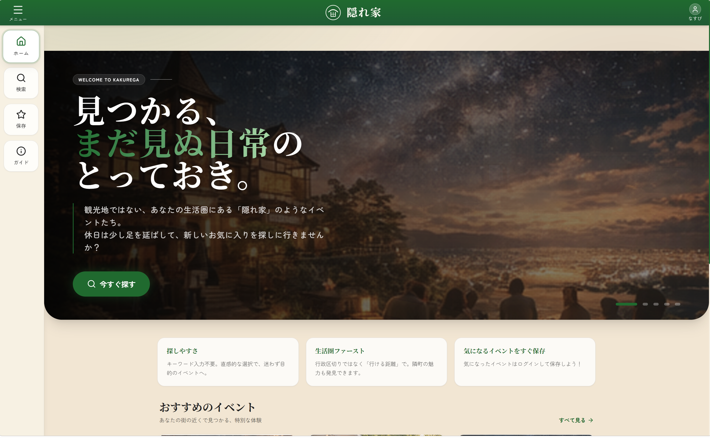
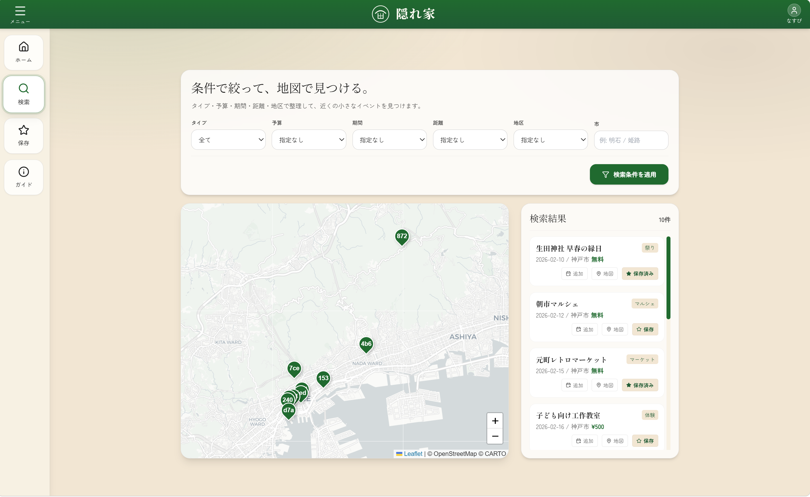
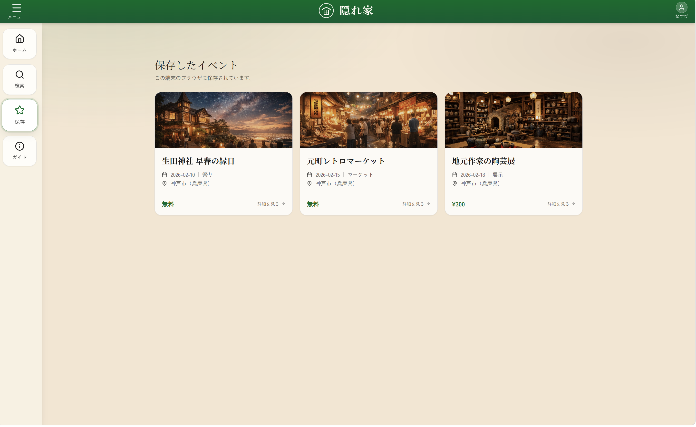

# Kakurega

地域の中にある「隠れ家のようなイベント」を見つけられるWebアプリケーションです。  
観光地ではなく、生活圏に存在する小規模イベントとの出会いを支援することを目的としています。

---

## 概要

兵庫県内のイベント情報を対象に、行政区分（市町村）に依存しない検索を可能にし、  
ユーザが自分の生活圏を基準としてイベントを探索できる仕組みを提供します。

既存のイベントサービスでは、

- 大規模イベントが優先される
- 市町村単位で情報が分断される

といった問題があり、近隣で参加可能なイベントが見つけにくい状況があります。

本アプリではこれらの課題に対して、

- 距離ベースの探索
- 地図を用いた可視化
- カテゴリや日時による柔軟な検索

を組み合わせることで、小規模イベントの発見性向上を目指しています。

---

## 主な機能

- イベント一覧・検索機能（距離・カテゴリ・日時）
- 地図ベースでのイベント表示
- イベント詳細モーダル表示
- お気に入り保存機能（ログイン必須）
- カレンダー追加機能
- ログイン / 認証（Supabase）

---

## 使用技術

- フロントエンド  
  - React / TypeScript  
  - Tailwind CSS  

- バックエンド / BaaS  
  - Supabase（Auth / Database / Storage）

- その他  
  - React Router  
  - Leaflet（地図表示）  
  - Lucide Icons  

---

## 工夫した点

### 行政区分に依存しない探索設計
市町村単位ではなく、位置情報（緯度・経度）を基にした探索を行うことで、  
「隣の市にあるが近いイベント」を自然に見つけられるようにしています。

---

### 認証とアクセス制御
お気に入り機能に対してRLS（Row Level Security）を適用し、  
ユーザごとに安全にデータを管理できるようにしています。

---

### 画像管理とキャッシュ対策
Supabase Storageを用いてイベント画像を管理し、  
CDNキャッシュによる表示不整合を防ぐためにURLのバージョニングを導入しています。

---

### 探索体験を意識したUI設計
イベント名を知らない状態での利用を前提とし、

- 地図表示
- カテゴリ絞り込み
- 視覚的なカードUI

を組み合わせることで、直感的にイベントを見つけられる設計にしています。

---

## 今後の改善点・展望

現段階では、小規模イベントの情報を十分に収集できておらず、  
兵庫県内のイベントを一部ピックアップした形で実装しています。

本来の目的である「生活圏内の小規模イベントの発見性向上」を実現するためには、  
より多くの地域イベント情報を継続的に収集する仕組みが必要です。

そのため、今後は以下のような展開を想定しています。

- 地方自治体や地域団体との連携によるイベント情報の提供体制の構築  
- 主催者自身がイベント情報を登録できる仕組みの整備  
- 情報の更新・正確性を維持するための運用設計  

また、本システムの開発背景には、  
地域で行われているイベントが十分に知られず、参加者が限られてしまっている現状に対する問題意識があります。

地域のイベントは、その土地の文化や人とのつながりを生む重要な機会であり、  
それらが埋もれてしまう状況は望ましくないと考えています。

本システムを通して、そうしたイベントがより多くの人に届き、  
地域の活動が継続的に盛り上がっていくことを目指しています。

---

## 補足

本アプリで使用している画像は、著作権に配慮し、  
AI生成画像または適切な素材を使用しています。

---

## UIイメージ

### トップ画面

---

### 検索画面

---

### イベント一覧

